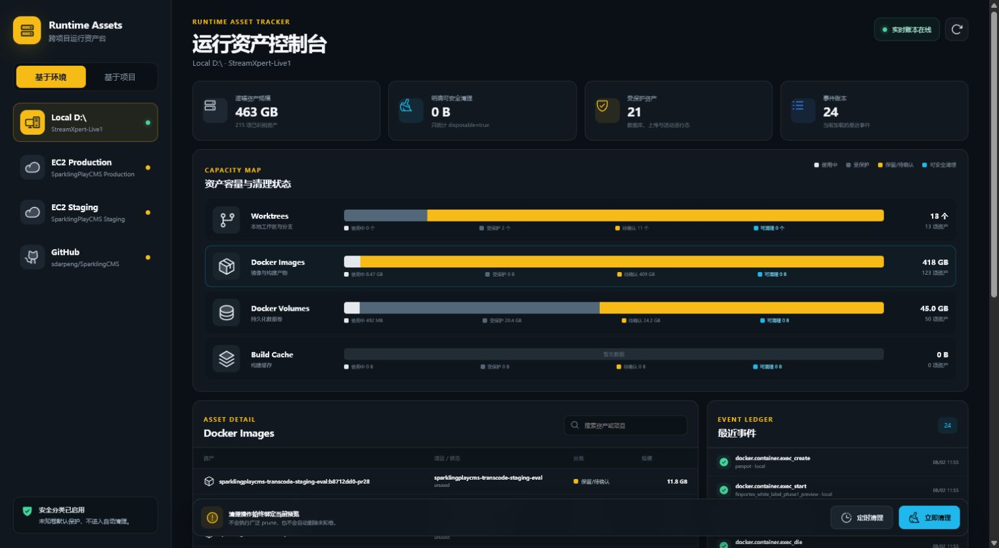

# Runtime Asset Tracker

Runtime Asset Tracker is a Codex plugin for inspecting and tracing runtime assets across local projects, Docker hosts, AWS EC2 instances, and GitHub Actions.

It provides:

- A graphical dashboard for worktrees, Docker images, volumes, build cache, and lifecycle events.
- Portable Docker and Compose labels.
- An append-only JSONL event ledger.
- Exact local cleanup previews that only include explicitly disposable assets.
- AWS Systems Manager or OpenSSH inventory for project-bound EC2 Production and Staging, including root-disk total/used/free capacity, image unique-layer usage, running/stopped container references, real volume sizes, and volume mount relationships.
- A non-secret connection identity panel for AWS Account ID, IAM principal, region, availability zone, instance ID, host, OS user, application path, and credential profile.
- GitHub Actions cache, artifact, and workflow inventory, with safe cleanup limited to expired artifacts, closed-PR caches, and caches not accessed for more than 30 days.

Every cleanup starts with an expiring exact-item preview and is revalidated immediately before execution. EC2 cleanup can remove exact unreferenced dangling or explicitly disposable image IDs, exact unreferenced explicitly disposable non-business volume names, and unused BuildKit cache. It never performs broad image/volume prune, forced deletion, container deletion, release deletion, or rollback deletion. Unknown volumes and assets without sufficient disposal evidence remain protected.



## Install in Codex

Add this private GitHub repository as a marketplace:

```text
codex plugin marketplace add sdarpeng/Runtime-Asset-Tracker
```

Install the plugin:

```text
codex plugin add runtime-asset-tracker@sparklingplay-runtime-assets
```

Start a new Codex task after installation so the skill and MCP server are loaded.

## Local development

```text
cd plugins/runtime-asset-tracker
npm install
npm run build
npm test
node tests/mcp-smoke.mjs
```

The built MCP server and dashboard are committed under `dist/`, so an installed marketplace copy can start without rebuilding the UI.

## Configuration

Copy `plugins/runtime-asset-tracker/assets/dashboard-config.example.json` to the platform-specific Runtime Asset Tracker state directory and replace the example Git roots, EC2 instance IDs, regions, and GitHub repository.

- Windows: `%LOCALAPPDATA%\RuntimeAssetTracker\dashboard-config.json`
- Linux: `~/.local/state/runtime-asset-tracker/dashboard-config.json`

AWS inventory requires authenticated AWS CLI access and online Systems Manager managed instances. SSH inventory uses a named OpenSSH profile with strict host-key verification. Configuration may contain non-secret identity metadata and credential-profile names, but must never contain private-key bytes, passwords, AWS access keys, session tokens, or browser cookies. GitHub inventory requires an authenticated GitHub CLI session.

## Repository layout

- `.agents/plugins/marketplace.json` — Codex team marketplace catalog.
- `plugins/runtime-asset-tracker/.codex-plugin/plugin.json` — plugin manifest.
- `plugins/runtime-asset-tracker/dist/` — ready-to-run MCP server and dashboard.
- `plugins/runtime-asset-tracker/skills/` — Codex skill instructions.
- `plugins/runtime-asset-tracker/scripts/` — labeling, Compose, observer, and installer utilities.
