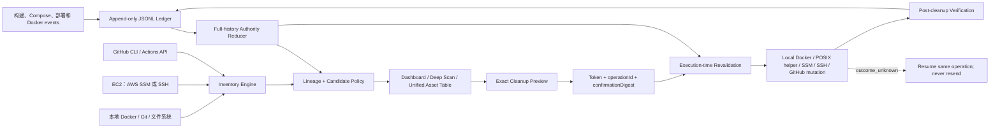

# Runtime Asset Tracker（运行时资产追踪器）

Runtime Asset Tracker 是一个面向 Codex 的运行时资产治理插件，用于跨项目、跨环境地盘点、追踪、解释和安全清理 Docker、Git worktree、主机目录、AWS EC2 与 GitHub Actions 资产。

当前版本：`0.5.0+codex.20260814-autonomy-lifecycle.1`

它解决的不是“怎么一键 prune”，而是更困难也更重要的问题：

- 这个镜像、容器、卷、目录或构建缓存是谁创建的？
- 它属于哪个项目、环境、Git revision、PR、release 或 Codex 任务？
- 当前或停止的容器是否仍然引用它？
- 它是不是 current、rollback、recovery、数据库、上传文件或共享依赖？
- 是否存在可验证的恢复来源？
- 它只是“看起来旧”，还是已经满足机器可执行的退休条件？
- 如果远端删除结果不确定，怎样恢复同一操作而不重复发送删除命令？

> **核心原则：广泛发现，窄范围执行。** Tracker 会尽量把疑似污染全部展示出来，但只把通过实时安全复核的精确资产放进删除 token。年龄、名称相似、`v1/v2/v3`、PR 已合并、容器已停止、Docker 显示 reclaimable，都不能单独构成删除授权。


## 目录

- [核心能力](#核心能力)
- [支持的资产和数据源](#支持的资产和数据源)
- [技术架构](#技术架构)
- [资产生命周期与退休判定](#资产生命周期与退休判定)
- [安全清理协议](#安全清理协议)
- [安装](#安装)
- [配置](#配置)
- [使用方法](#使用方法)
- [接入构建和部署流程](#接入构建和部署流程)
- [MCP 工具说明](#mcp-工具说明)
- [机器可读 reconciliation](#机器可读-reconciliation)
- [安全边界](#安全边界)
- [状态目录与数据文件](#状态目录与数据文件)
- [本地开发与验证](#本地开发与验证)
- [常见问题](#常见问题)
- [仓库结构](#仓库结构)

## 核心能力

### 1. 跨环境统一资产表

Tracker 可以把同一个注册项目的以下来源合并成统一资产表：

- Local：本地 Docker、Git worktree、残留目录和生成物。
- Production：AWS EC2 或 SSH 主机上的 Docker 与受管路径。
- Staging：AWS EC2 或 SSH 主机上的 Docker 与受管路径。
- GitHub：仓库 revision、PR、Actions artifact、cache 和 workflow run。

统一表使用精确资产 ID，而不是只按显示名称拼接。它会关联 Git revision、PR 状态、冷却期、运行时引用、恢复来源和 current/rollback 保护关系。

### 2. Docker 全量盘点与真实依赖分析

可盘点：

- 镜像及全部 tag、digest、创建时间、OCI revision/source 标签。
- 运行中、已停止、created、restarting 等状态的容器。
- 容器到镜像的引用关系。
- 容器到 volume、bind mount 的挂载关系。
- volume 的真实占用、引用状态和持久化风险信号。
- network、BuildKit cache 与磁盘容量。
- 远端镜像的唯一层占用，减少共享层导致的重复计数误差。

### 3. 连续构建和失败构建发现

Tracker 不依赖人工补打 `disposable=true` 才发现垃圾。它会综合：

- 同一注册项目、同一镜像仓库、同一服务族。
- 精确 image ID、tag、revision 和创建顺序。
- append-only 账本中的 `build.succeeded`、`build.completed`、`build.failed` 最后事件。
- 新构建是否真正成功，或是否已被运行中/created/restarting 容器消费。
- 旧构建是否有消费者、恢复来源和冷却期。
- 磁盘是否处于 normal、warning 或 critical 压力。

匿名 `<none>` 镜像没有稳定仓库身份，不会被强行串成同一构建链。容量压力只会扩大候选可见性和排序，不能绕过任何安全 blocker。

### 4. Git worktree、残留目录和主机生成物盘点

Tracker 会：

- 读取 Git 已注册 worktree。
- 扫描配置的 `worktreeRoots`、`residualRoots` 和 Codex worktree 根目录。
- 发现与仓库前缀相关但已经脱离 Git 注册的物理残留目录。
- 按真实文件字节计算空间，而不是只统计目录数量。
- 单独识别 `node_modules`、`dist`、`build`、`.next`、测试产物、压缩包、分卷文件和大型文件。
- 为路径生成稳定的 `path-sha256:*` 资产 ID 和内容元数据 fingerprint。
- 不跟随符号链接、junction 或 reparse point。
- 避免将父目录与其内部生成物重复计费。

### 5. 深度血缘报告

`deep_scan_runtime_lineage` 会只读输出：

- owner、project、environment、service。
- Git revision、release、PR 和任务 outcome。
- 消费者及其状态。
- retention、expiry、recovery source。
- current、rollback、recovery、shared 等保护身份。
- 缺失证据与显式 blocker。
- superseded build chain。
- 磁盘容量压力和候选字节数。
- authoritative ledger 的完整历史校验状态。

### 6. 图形化 Dashboard

Dashboard 支持：

- 项目与环境切换。
- Local、Production、Staging、GitHub 对比。
- retained、protected、expiring、reclaimable 容量条。
- 资产明细、引用关系、事件时间线和连接身份。
- AWS account、region、AZ、instance、OS user、应用路径等非秘密身份信息。
- 只读深扫、统一资产表、清理预览和结果查看。

### 7. 精确清理和事后验证

Tracker 不执行 `docker system prune`。每次清理都经过：

1. 实时盘点。
2. 候选分类。
3. 精确 allowlist 预览。
4. 用户确认 token 与 digest。
5. 执行前再次读取 authority 和运行状态。
6. 仅删除 exact ID、tag 或 path。
7. 事后复扫活动容器、残留对象和磁盘增量。

### 8. 远端不确定结果恢复

AWS SSM 调用一旦进入可能已发送的状态，就不会自动重发。若返回 `outcome_unknown`，Tracker 会保留：

- `operationId`
- `commandId`（已知时）
- 原始 exact allowlist
- durable `cleanup.operation.started` 事件
- `resumeToken`

随后只能调用 `resume_cleanup` 轮询和核对同一个 SSM operation，不能创建第二次删除命令。

## 支持的资产和数据源

| 数据源 | 盘点能力 | 可执行清理范围 |
| --- | --- | --- |
| Local Docker | 镜像、容器、卷、网络、BuildKit cache、引用和标签 | 通过实时复核的精确镜像、显式可丢弃容器、严格证明可丢弃的卷、未使用 BuildKit cache |
| Local filesystem | Git worktree、残留目录、生成目录、压缩包、大文件 | POSIX 上通过 fingerprint 和根目录约束的残留/生成物；Windows 路径当前为 preview-only |
| AWS EC2 / SSM | Docker、根盘容量、镜像唯一层、容器引用、卷、active release、受管路径 | 精确镜像、卷、BuildKit cache、已证明退休且保留卷的容器、受管根目录下的精确路径 |
| OpenSSH | 与 EC2 相同的只读快照和精确远端清理 | 与 SSH 配置和远端安全复核允许的 exact allowlist 一致 |
| GitHub | Actions artifacts、caches、workflow runs、PR/revision authority | 已过期 artifact、closed PR cache、超过 30 天未访问的 cache |

网络、未管理目录、未知 volume、current/rollback/recovery 身份和所有证据不足的对象始终不进入可执行清单。

## 技术架构



### 主要模块

| 模块 | 文件 | 职责 |
| --- | --- | --- |
| MCP 与 HTTP 服务 | `mcp/server.mjs` | 注册工具、提供 MCP Apps Dashboard、认证 loopback HTTP、暴露运行时身份 |
| Inventory Engine | `mcp/inventory.mjs` | 本地/远端统一盘点、账本 authority、预览 token、执行与恢复编排 |
| Candidate Policy | `mcp/candidate-policy.mjs` | 失败构建、连续构建、容量压力和 blocker 判定 |
| Remote Adapter | `mcp/remote.mjs` | AWS SSM、SSH、GitHub 盘点和精确 mutation、结果传输与验证 |
| Path Assets | `mcp/path-assets.mjs` | worktree/残留/生成物扫描、真实字节、fingerprint 和安全路径删除 |
| Reconciliation | `mcp/reconciliation.mjs` | 历史镜像退休/保护证明导入 |
| Unified Reconciliation | `mcp/lifecycle-reconciliation.mjs` | 已合并 PR 对应容器、镜像、卷和受管路径证明导入 |
| Unified Asset Table | `mcp/lifecycle-table.mjs` | Local/Production/Staging 与 GitHub authority 关联 |
| Event Ledger | `scripts/runtime-asset-ledger.mjs` / `.py` | 记录构建、部署、Compose、Docker events 和 snapshot |
| Compose Wrapper | `scripts/run-compose.mjs` | 在 Compose 前后写入事件并执行 snapshot |
| POSIX 删除助手 | `scripts/safe-delete-path.py` | handle-relative、no-follow 的精确路径删除 |
| Build Pipeline | `scripts/build-plugin.mjs` | 打包 MCP、Dashboard 与 provenance，生成 SHA-256 身份 |

### 两种运行模式

1. **Codex MCP stdio 模式**：插件安装后由 Codex 启动，工具调用与 Dashboard 直接集成。
2. **本地 HTTP 模式**：执行 `node dist/server.mjs --http`，只监听 `127.0.0.1`/`localhost`，输出一次性登录 URL。

HTTP 模式包含 Host 校验、Bearer 或 HttpOnly session、SameSite=Strict、Origin 校验、12 小时 session 和 1 MiB 请求体限制。它不能绑定公网地址。

### Build provenance 与运行时完整性

构建产物提交在 `dist/`，安装后不需要重新构建 UI。`dist/build-provenance.json` 记录：

- source commit/tree/digest
- source dirty 状态
- bundled server SHA-256
- Dashboard SHA-256
- POSIX safe-delete helper SHA-256
- build digest

运行时会重新计算 server 和 helper 的实际 hash。路径删除助手完整性不匹配时，路径执行会 fail closed。

## 资产生命周期与退休判定

### 展示分类

- `active`：当前运行或活动 release。
- `protected`：current、rollback、recovery、数据库、上传、共享依赖或显式保护。
- `retained`：仍应保留或证据不足。
- `expiring`：进入到期前七天观察窗口，但尚不可删除。
- `reclaimable`：底层实时分类已经满足可回收条件。

### 退休候选状态

- `suspected-retired`：存在退休信号，但尚未形成可执行证据。
- `blocked-candidate`：候选成立，但存在明确 blocker。
- `executable-candidate`：全部执行条件通过，才允许进入 preview token。

常见 blocker：

- 仍有运行中或已停止容器引用。
- 缺少 recovery source。
- 新镜像成功证据不足。
- 仍在 cooling period。
- current、rollback、recovery 或 protected identity。
- 远端自动候选没有精确 reconciliation。
- volume 缺少独立的持久化数据证明。
- 路径不在 managed root、fingerprint 漂移或存在 bind mount consumer。
- Windows 缺少 native handle-relative 路径删除能力。
- preview 后 authority 新增保护、撤销退休或发生身份漂移。

### 为什么不依赖人工 tag

`com.codex.runtime.disposable=true` 只是资格提示，不是唯一发现入口，也不是删除授权。Tracker 还会读取：

- Docker 精确身份和消费者。
- Git/PR authority。
- 构建成功/失败最后事件。
- 同仓库同服务族的连续构建链。
- 任务 outcome 与路径 fingerprint。
- 磁盘压力。

因此即使人工漏打 tag，污染仍会进入 suspected/blocked 视图；但缺少关键证明时仍不会被自动删除。

### PR 合并不是删除授权

PR `MERGED` 只表示一个重要生命周期信号。进入执行候选仍需同时满足：

- authoritative merge time。
- cooling period 完成。
- main/release 验证或成功 successor 证据。
- 精确 runtime/path identity。
- 零引用或精确容器退休证明。
- recovery source。
- 非 current/rollback/recovery/protected。

## 安全清理协议

### Preview

`preview_cleanup` 创建一个十分钟有效的 exact allowlist，返回：

- `token`
- `operationId`
- `confirmationDigest`
- `actorId`
- `serverInstanceId`
- `expiresAt`
- 精确资产 ID、tag、path、bytes、恢复来源和退休证明

Host-wide `project=all` 预览必须显式提供 `assetIds`，不允许无边界全机清理。

### Confirm

只有用户确认同一个 token 和 allowlist 后，才能调用：

```json
{
  "token": "preview-token-uuid",
  "confirmed": true,
  "confirmationDigest": "64-character-sha256"
}
```

Token 与 authenticated actor、server instance、operation ID 和 allowlist digest 绑定，且只能消费一次。过期、进程重启、actor 不一致或 digest 不一致都会零 mutation 拒绝。

### Execute-time revalidation

执行前会重新检查：

- asset 是否仍存在且仍属于同一 project/environment。
- image ID 与全部 approved tag 是否仍一致。
- container state、image ID、Compose project 和 mounts 是否漂移。
- volume 是否仍未引用、是否存在业务数据风险信号。
- path bytes、fingerprint、managed root 和 consumer 是否一致。
- current/rollback/protection/revocation authority 是否变化。
- automatic retirement 的 successor、tag、创建时间和成功证据是否变化。

多 tag 镜像按一个原子资产处理：所有精确 tag 必须仍指向同一 image ID，删除后 image 必须确实消失；不使用 `--force` 掩盖冲突。

### Durable authority 与远端线性化点

远端 mutation 前，Tracker 会把包含完整 allowlist 的 `cleanup.operation.started` 以 append + fsync 写入 authoritative ledger。然后重新读取全历史 authority；只有 protection、retirement、digest 和 ordinal 都稳定时才允许发送远端命令。

### 结果状态

- `complete`：全部删除并通过验证。
- `partial`：部分删除，另有失败或跳过。
- `failed`：明确未发送或明确失败。
- `outcome_unknown`：命令可能已发送，但终态无法证明。

`outcome_unknown` 只能通过 `resume_cleanup` 恢复同一 `operationId`。恢复逻辑只查询已有 SSM command，不会重新发送删除请求。

### 卷保护

容器退休始终使用“不带 `-v`”的删除语义。已合并 PR 容器必须在 reconciliation 中显式声明：

- `preserveVolumes=true`
- 精确 mount set
- 需要时 `stopBeforeRemoval=true`

未知卷、数据库、上传、媒体、备份、队列和持久化缓存默认保护。

## 安装

### 作为 Codex Marketplace 插件安装

添加 GitHub 仓库为 marketplace：

```text
codex plugin marketplace add sdarpeng/Runtime-Asset-Tracker
```

安装插件：

```text
codex plugin add runtime-asset-tracker@sparklingplay-runtime-assets
```

安装后新建或重启一个 Codex 任务，使 skill、MCP server 和 Dashboard 被重新加载。

### 前置工具

按使用范围安装：

- 必需：Node.js、Git。
- 本地 Docker 盘点：Docker Desktop 或 Docker Engine。
- AWS SSM：AWS CLI，已登录的 profile，目标实例为在线 managed instance。
- SSH：OpenSSH client，已配置并验证 host key 的命名 profile。
- GitHub：GitHub CLI `gh`，已完成认证。

凭证必须保存在各自官方凭证存储中。Tracker 配置只引用 profile 名称，不保存 access key、session token、密码、private key、cookie 或浏览器 session。

## 配置

复制示例文件：

`plugins/runtime-asset-tracker/assets/dashboard-config.example.json`

到状态目录：

- Windows：`%LOCALAPPDATA%\RuntimeAssetTracker\dashboard-config.json`
- Linux：`~/.local/state/runtime-asset-tracker/dashboard-config.json`

最小配置示例：

```json
{
  "gitRoots": ["D:\\MyProject"],
  "worktreeRoots": ["D:\\CodexWorktrees"],
  "residualRoots": [],
  "projects": [
    {
      "id": "owner/repository",
      "repository": "owner/repository",
      "label": "My Project",
      "aliases": ["my-project"],
      "gitRoots": ["D:\\MyProject"],
      "environments": [
        {
          "id": "production",
          "kind": "aws-ssm",
          "region": "us-east-2",
          "instanceId": "i-production",
          "awsProfile": "my-project-prod",
          "activeLink": "/home/ec2-user/apps/my-project",
          "releaseRoot": "/home/ec2-user/apps/my-project-releases",
          "managedPaths": [
            {
              "path": "/home/ec2-user/apps/my-project-evaluations",
              "kind": "evaluation-artifact"
            }
          ]
        },
        {
          "id": "staging",
          "kind": "aws-ssm",
          "region": "us-east-2",
          "instanceId": "i-staging"
        }
      ]
    }
  ],
  "schedule": {
    "enabled": false,
    "cadence": "weekly",
    "day": "sunday",
    "time": "03:00",
    "mode": "preview-only"
  }
}
```

### 关键字段

| 字段 | 说明 |
| --- | --- |
| `gitRoots` | 本地主仓库根目录 |
| `worktreeRoots` | 受管 worktree 根目录 |
| `residualRoots` | 额外残留目录根；应尽量精确 |
| `pathScan.maxEntries` | 单次路径扫描最大条目数，默认 400000 |
| `pathScan.largeFileBytes` | 大文件阈值，默认 100 MiB |
| `threadBindings` | 将路径绑定到 Codex task、outcome 和完成状态 |
| `projects[].id` | 全局稳定项目 ID，通常使用 `owner/repository` |
| `projects[].aliases` | 允许的项目别名 |
| `environments[].kind` | `aws-ssm` 或 SSH 类型适配器 |
| `activeLink` | 当前活动 release 链接或目录 |
| `releaseRoot` | 受管 release 根目录 |
| `managedPaths` | 允许精确治理的其他远端根目录 |
| `awsProfile` | AWS CLI profile 名称，不是凭证内容 |
| `schedule.mode` | 固定为 preview/report-only；不能静默开启无人值守删除 |

## 使用方法

### 在 Codex 中打开 Dashboard

可以直接说：

```text
打开 Runtime Asset Tracker，显示 SparklingCMS 的 Local、Production、Staging 和 GitHub 资产。
```

或：

```text
对 owner/repository 做全量只读血缘扫描，列出 suspected、blocked 和 executable 候选。
```

### 本地独立 HTTP Dashboard

```text
cd plugins/runtime-asset-tracker
node dist/server.mjs --http
```

服务只监听 loopback，并输出一次性 URL：

```text
Runtime Asset Tracker dashboard: http://127.0.0.1:47831/?access=...
```

不要把 URL 中的 access nonce 写入日志、README、工单或聊天记录。

### 推荐清理流程

```text
1. open_runtime_dashboard / deep_scan_runtime_lineage
2. build_unified_asset_table
3. 导入必要的 reconciliation
4. preview_cleanup
5. 向用户展示 allowlist、保护项、排除项、bytes、token 和 digest
6. 用户确认精确 token
7. execute_cleanup
8. 如果 outcome_unknown，只调用 resume_cleanup
9. 再次扫描并报告实际磁盘增量
```

### 本地 Build Cache

BuildKit cache 可独立预览：

```text
preview_cleanup(source="local", types=["cache"])
```

执行时使用：

```text
docker builder prune --all --force
```

该操作不包含 image、container 或 volume。Windows Docker Desktop 的数据位于动态 VHDX 时，cache 删除通常只增加 VHD 内部空闲；要把空间真正归还物理盘，仍需在 Docker/WSL 完全停止后单独压缩 VHDX。Tracker 不会自动做这个主机级操作。

## 接入构建和部署流程

### OCI / Compose 标签

所有值都使用字符串：

| 标签 | 含义 |
| --- | --- |
| `com.codex.runtime.project` | 稳定项目 ID |
| `com.codex.runtime.environment` | `local`、`staging`、`production`、`ci` |
| `com.codex.runtime.release` | release ID 或 `development` |
| `com.codex.runtime.git-sha` | 完整 Git commit |
| `com.codex.runtime.pull-request` | 由 CI/GitHub 权威提供的 PR 编号 |
| `com.codex.runtime.task-id` | 稳定 Codex task/outcome 绑定 |
| `com.codex.runtime.owner` | 责任人或团队 |
| `com.codex.runtime.asset-kind` | `image`、`container`、`volume`、`network` |
| `com.codex.runtime.service` | `api`、`web`、`postgres` 等服务 |
| `com.codex.runtime.retention` | `development`、`release`、`rollback`、`cache`、`protected` |
| `com.codex.runtime.disposable` | 是否可能成为候选；不是删除授权 |
| `com.codex.runtime.created-by` | `docker-compose`、`deploy-prod.sh`、`ci` 等入口 |
| `com.codex.runtime.expires-at` | ISO-8601 到期时间 |
| `com.codex.runtime.ttl-days` | 从可信创建时间计算的天数 |
| `com.codex.runtime.recovery-source` | GitHub Actions、release、backup 等恢复来源 |

镜像还应保留：

- `org.opencontainers.image.revision`
- `org.opencontainers.image.source`

示例见 `plugins/runtime-asset-tracker/assets/compose-labels.example.yml`。

### 记录普通事件

```text
node scripts/runtime-asset-ledger.mjs record \
  --event build.started \
  --project my-project \
  --environment local \
  --detail service=api
```

### 记录构建后的精确镜像

```text
node scripts/runtime-asset-ledger.mjs image \
  --event build.completed \
  --image my-api:latest \
  --project my-project \
  --environment local
```

### 生成 reconciliation snapshot

```text
node scripts/runtime-asset-ledger.mjs snapshot \
  --project my-project \
  --environment staging
```

### 包装 Compose 入口

```text
node scripts/run-compose.mjs \
  --project my-project \
  --environment local \
  -- up --build
```

Wrapper 会记录 started/completed/failed，并在命令后尝试 snapshot。账本不可用只产生 warning，不应阻断原本合法的构建或部署。

### Windows Docker event watcher

```powershell
& .\scripts\Install-Windows.ps1 \
  -Project my-project \
  -Environment local \
  -Owner platform-engineering
```

安装器写入当前用户启动项并启动隐藏 watcher，但不会重启 Docker Desktop 或应用容器。

### Linux Docker event watcher

```bash
sudo ./scripts/install-linux.sh \
  --project my-project \
  --environment production \
  --owner platform-engineering
```

Linux 优先使用 Node.js；无 Node 时回退到 Python 3 标准库版本。安装器创建 systemd service、logrotate 和 `/usr/local/bin/runtime-asset-ledger`，不会重启 Docker 或应用容器。

## MCP 工具说明

| 工具 | 是否写状态 | 是否删除 | 作用 |
| --- | --- | --- | --- |
| `open_runtime_dashboard` | 否 | 否 | 打开/刷新 Local、EC2 和 GitHub Dashboard |
| `deep_scan_runtime_lineage` | 否 | 否 | 深度解释 owner、引用、revision、retention、recovery 和 blocker |
| `build_unified_asset_table` | 可选写报告文件 | 否 | 关联 Local/Production/Staging 与 GitHub authority |
| `import_retirement_reconciliation` | 是，追加账本 | 否 | 导入历史远端镜像退休/保护证明 |
| `import_path_retirement_reconciliation` | 是，追加账本 | 否 | 导入 worktree/残留/生成物精确证明 |
| `import_unified_retirement_reconciliation` | 是，追加账本 | 否 | 导入 merged PR 对应容器、镜像、卷和远端路径证明 |
| `preview_cleanup` | 内存 token | 否 | 生成十分钟有效的 exact allowlist |
| `execute_cleanup` | 是 | 是 | 消费用户确认的 token，并实时复核后执行 |
| `resume_cleanup` | 是，记录恢复事件 | 否，不重发 | 查询同一个 AWS SSM operation 的终态 |
| `save_cleanup_schedule` | 是 | 否 | 保存 report/preview-only 计划，不启用无人值守删除 |

## 机器可读 reconciliation

Tracker 支持三类证明。导入只追加 authority event，不会删除资产。

### 1. 历史镜像 reconciliation

Schema：

```text
sparkling.runtime-image-retirement-reconciliation/v1
```

适合无法给历史镜像补 OCI 标签的场景，绑定 project、environment、instance、image ID、完整 tag 集合、revision、恢复来源、保护集合和报告 SHA-256。

### 2. 本地路径 reconciliation

Schema：

```text
sparkling.runtime-path-retirement-reconciliation/v1
```

每个资产必须包含：

- 派生的 `path-sha256:*` ID。
- 绝对路径。
- `expectedBytes`。
- `contentFingerprint`。
- `confidence=high-exact`。
- `recoverySource`。
- `disposable=true` 与 `retention=retired`。
- 可选 `threadId`、`outcomeId`。

示例：`plugins/runtime-asset-tracker/assets/path-retirement-reconciliation.example.json`。

### 3. 统一 merged-PR reconciliation

Schema：

```text
sparkling.runtime-unified-retirement-reconciliation/v1
```

支持 exact container、image、volume 和 managed remote path。必须提供 authoritative merge time、完成的冷却期、恢复来源以及类型相关证据：

- Container：full ID、name、image ID、Compose project、state、mount set、`preserveVolumes=true`。
- Image：image ID、完整 approved tags、revision、零引用。
- Volume：精确名称、零引用、无数据库/上传/媒体/备份信号。
- Path：managed root、bytes、fingerprint、零 bind-mount consumer。

导入时 project、source、instance、group、bytes、tag、revision 或保护集合不一致会 fail closed。

## 安全边界

Tracker **不会**：

- 执行 `docker system prune`。
- 将“停止”“旧”“大”“dangling”直接视为可删。
- 强制删除仍被引用的镜像。
- 使用 `docker rm -v` 删除容器卷。
- 自动删除未知、数据库、上传、媒体、备份或共享卷。
- 删除 current、rollback、recovery、primary 或 protected 资产。
- 仅凭目录名、`v1/v2/v3`、任务名称相似或 PR 合并删除 worktree。
- 跟随符号链接、junction 或 reparse point 扫描/删除。
- 在没有 exact managed root 和 fingerprint 的情况下删除远端目录。
- 在远端断开时用本地数据伪装 Production/Staging 结果。
- 把密钥、token、cookie、private key 或密码写入配置或账本。
- 自动开启无人值守删除。
- 在 `outcome_unknown` 后重新发送远端删除命令。

### 平台差异

- POSIX 残留/生成物：只有通过 SHA-256 完整性验证的 helper 才能执行 handle-relative、no-follow 删除。
- Git 已注册 worktree：当前仍以 inventory/reconciliation 为主，直到 Git metadata 和目录 handle 可以绑定在同一验证链。
- Windows filesystem path：当前为 preview-only；Docker 清理不受影响。

### AWS SSM 传输

远端快照超过 Run Command inline output 限制时，会自动切换到分块传输：

- gzip 压缩并编码。
- 临时文件权限收紧。
- 按长度和 SHA-256 校验。
- 有界分块读取。
- 精确清理临时结果路径。

配置只包含 account/profile/instance 等非秘密引用。

## 状态目录与数据文件

默认状态根：

- Windows：`%LOCALAPPDATA%\RuntimeAssetTracker`
- Linux：`${XDG_STATE_HOME:-~/.local/state}/runtime-asset-tracker`

可通过 `RUNTIME_ASSET_STATE_DIR` 覆盖。

典型文件：

| 文件 | 作用 |
| --- | --- |
| `dashboard-config.json` | 注册项目、路径和远端来源 |
| `events.jsonl` | append-only authoritative event ledger |
| cleanup schedule 文件 | preview-only 计划 |
| 临时 transport/result 文件 | 远端大结果传输；操作结束后精确清理 |

账本只记录受限的运行时元数据和允许的标签，不记录任意 Docker event attribute 或 secret 值。

## 本地开发与验证

```text
cd plugins/runtime-asset-tracker
npm ci
npm run build
npm test
node tests/mcp-smoke.mjs
```

主要验证覆盖：

- candidate policy 与失败/连续构建反例。
- actor、server instance、digest、single-use token 绑定。
- full-history ledger authority、protection precedence 和 append continuity。
- merged-PR 与路径 reconciliation 校验。
- SSM/SSH/GitHub 远端 snapshot 和 mutation failure state。
- `not_sent`、`failed`、`outcome_unknown` 区分。
- resume 不重发命令。
- HTTP loopback、Host、Origin、session 与请求体限制。
- 路径 fingerprint、reparse point、helper integrity 和 POSIX safe delete。
- MCP smoke test 与 committed bundle provenance。

构建后的 `dist/server.mjs`、`dist/dashboard.html` 和 `dist/build-provenance.json` 必须一并提交，保证 marketplace 安装副本无需现场重新构建。

## 常见问题

### 为什么 Docker 显示几十 GB reclaimable，Tracker token 却很小？

Docker 的 reclaimable 是容量估算，不包含项目血缘、恢复来源、current/rollback、停止容器引用、PR authority 和业务数据风险。Tracker 只把通过全部复核的 `executable-candidate` 放入 token。

### 为什么业务已经 close 或 PR 已合并，资产仍然没被删除？

Merge/close 是发现信号，不是删除授权。检查 deep scan 中的 blocker，常见原因是 cooling、successor 未证明、零引用不成立、缺少 recovery source 或仍属于 rollback/recovery。

### 为什么同一服务连续构建了很多镜像？

Tracker 会把同项目、同镜像仓库、同服务族的构建整理成 superseded chain，但只有新构建成功且旧镜像零引用、可恢复、冷却完成后，旧构建才可能执行。匿名镜像不会按名称猜测串链。

### 为什么容器删了，卷还在？

这是设计行为。容器退休默认保留卷，且永远不使用 `-v`。卷需要自己的零引用、业务数据分类和精确 disposable 证明。

### 为什么 Windows worktree 只能预览？

Windows 需要 native handle-relative、open-reparse-point 的删除助手，才能把路径身份验证和删除绑定到同一个句柄。当前版本选择 fail closed，避免 junction/TOCTOU 越界删除。

### 为什么清理 Docker 后 D 盘没有立刻增加？

Docker Desktop 通常把 Linux 数据存放在动态 VHDX。删除镜像/cache 只产生 VHD 内部空洞；物理分区空间要在 Docker 和 WSL 完全停止后单独压缩 VHDX。此操作是主机维护，不属于 Tracker 自动清理 token。

### AWS 清理返回 outcome_unknown 怎么办？

不要重新 preview 后立即重发。使用结果中的 `operationId`、`commandId` 和 `resumeToken` 调用 `resume_cleanup`，只核对原 SSM command。

### Tracker 会阻断构建或部署吗？

不会。构建/部署入口写账本采用 best-effort；Tracker 不引入新的 release approval gate。清理本身仍要求精确预览和用户确认。

## 仓库结构

- `.agents/plugins/marketplace.json`：Codex marketplace catalog。
- `plugins/runtime-asset-tracker/.codex-plugin/plugin.json`：插件 manifest 与能力声明。
- `plugins/runtime-asset-tracker/mcp/`：inventory、policy、reconciliation、remote 和 server 源码。
- `plugins/runtime-asset-tracker/ui/`：Dashboard React UI。
- `plugins/runtime-asset-tracker/dist/`：已构建 MCP server、Dashboard 和 provenance。
- `plugins/runtime-asset-tracker/skills/`：Codex skill 与标签规范。
- `plugins/runtime-asset-tracker/scripts/`：账本、Compose wrapper、watcher 安装器和安全路径助手。
- `plugins/runtime-asset-tracker/assets/`：配置、标签和 reconciliation 示例。
- `plugins/runtime-asset-tracker/tests/`：安全、authority、remote、path 和 MCP 测试。

## 维护约定

- 功能升级必须同时更新源码、测试、bundle、provenance 和本 README。
- 不得以手工 tag 作为唯一污染发现机制。
- 新增删除类型必须先具备 exact identity、live revalidation、恢复来源、用户确认和事后验证。
- 新增远端 mutation 必须定义真实 send point，以及 `not_sent` / `failed` / `outcome_unknown` 状态。
- 新增平台路径删除必须提供 handle-relative、no-follow 和越界防护，不能只依赖字符串 canonicalization。
- GitHub `main` 是发布权威；插件缓存目录不是开发源，不应直接修改。
